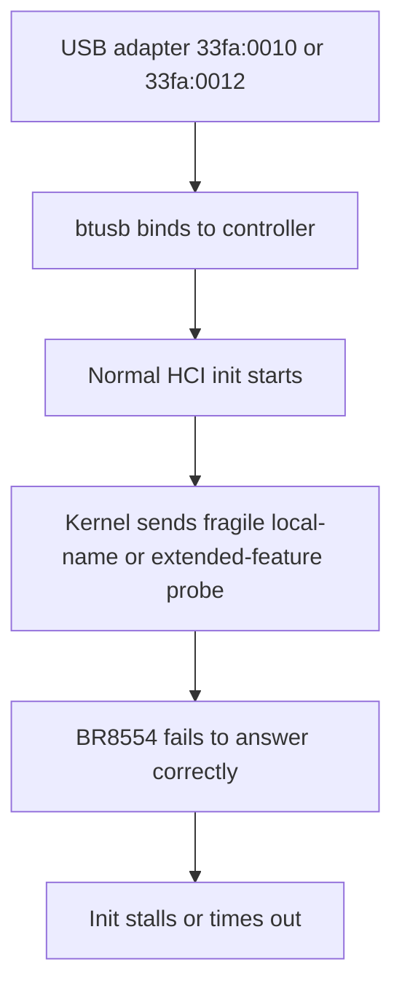
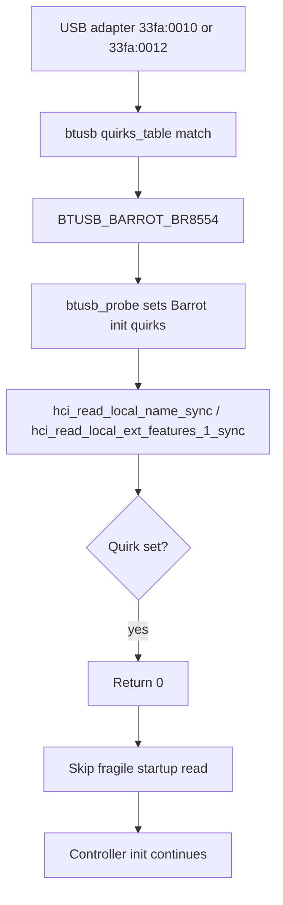
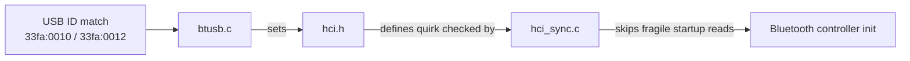
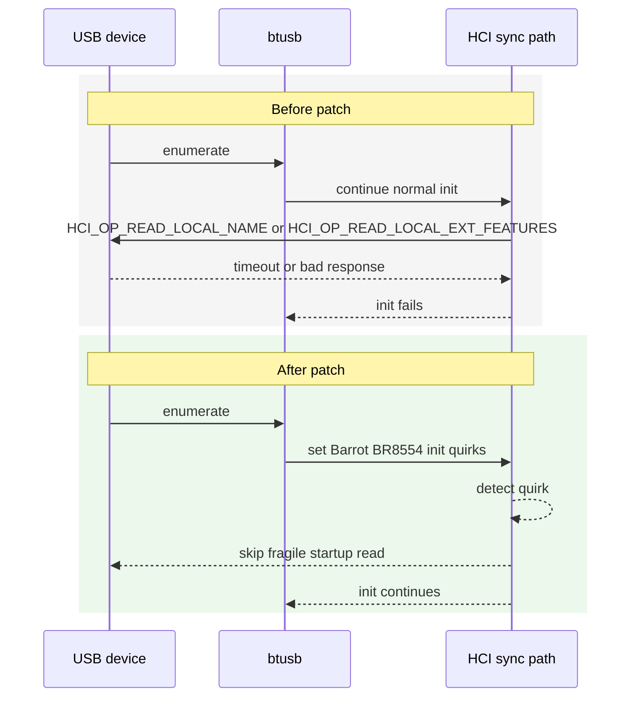

# Barrot BR8554 Patch Details

## Purpose

This document describes the full Linux Bluetooth patch set in this repository and the exact behavior it changes for Barrot BR8554-based USB adapters.

The patch exists because some BR8554 adapters fail during controller initialization when the kernel asks for local extended feature information or the BR/EDR local name. The failure prevents the controller from completing normal bring-up and can leave the HCI device down with a zero Bluetooth address.

## Affected Hardware

The patch is scoped to the following USB IDs:

- `33fa:0010`
- `33fa:0012`

Barrot is a China-based wireless/Bluetooth brand. Official site:
<https://en.barrot.com.cn/>.

No other adapters are matched by this patch.

## Problem Statement

During initialization, the Linux Bluetooth stack sends startup probes such as `HCI_OP_READ_LOCAL_NAME` and `HCI_OP_READ_LOCAL_EXT_FEATURES`. On affected Barrot BR8554 devices, those requests can time out, return malformed events, or wedge the command path. After that, `HCI_OP_RESET` may also fail and the adapter can show `00:00:00:00:00:00`.

The patch fixes that by marking the affected devices with a dedicated quirk bundle and skipping the failing non-essential reads for those devices only.

## Visual Overview

### 1. Failure Path Diagram



### 2. Patched Flow Diagram



### 3. Patch Wiring Schema

| Layer | File | Added symbol or logic | Role |
| --- | --- | --- | --- |
| USB driver | `drivers/bluetooth/btusb.c` | `BTUSB_BARROT_BR8554` | Device-specific match flag |
| USB driver | `drivers/bluetooth/btusb.c` | `33fa:0010`, `33fa:0012` in `quirks_table[]` | Limits scope to known BR8554 IDs |
| HCI core | `include/net/bluetooth/hci.h` | `HCI_QUIRK_BROKEN_LOCAL_EXT_FEATURES` | Named quirk bit for page-1 extended-feature read skip |
| HCI core | `include/net/bluetooth/hci.h` | `HCI_QUIRK_BROKEN_READ_LOCAL_NAME` | Named quirk bit for local-name read skip |
| HCI sync path | `net/bluetooth/hci_sync.c` | early returns in local-name and extended-feature reads | Prevents fragile startup probes from being sent |

## Files Changed by the Consolidated Patch

The direct-apply patch is [`patches/barrot_quirk.patch`](/data/barrot/patches/barrot_quirk.patch). It modifies three kernel files:

| Kernel file | Change | Effect |
| --- | --- | --- |
| `drivers/bluetooth/btusb.c` | Adds a new USB-side driver flag and matches the affected USB IDs | Marks BR8554 adapters as needing special handling |
| `include/net/bluetooth/hci.h` | Adds HCI quirk definitions | Gives the core stack named quirks for this behavior |
| `net/bluetooth/hci_sync.c` | Skips failing reads when quirks are present | Lets initialization continue instead of timing out |

## Detailed Change Breakdown

### 1. `drivers/bluetooth/btusb.c`

The patch adds a new `driver_info` bit:

- `BTUSB_BARROT_BR8554`

That flag is then attached to the Barrot device IDs in `quirks_table[]`:

- `USB_DEVICE(0x33fa, 0x0010)`
- `USB_DEVICE(0x33fa, 0x0012)`

When `btusb_probe()` runs, the patch checks whether the matched device carries that flag. If it does, the driver sets:

- `HCI_QUIRK_BROKEN_LOCAL_EXT_FEATURES`
- `HCI_QUIRK_BROKEN_LOCAL_EXT_FEATURES_PAGE_2`
- `HCI_QUIRK_BROKEN_READ_LOCAL_NAME`
- `HCI_QUIRK_BROKEN_STORED_LINK_KEY`
- `HCI_QUIRK_BROKEN_FILTER_CLEAR_ALL`
- `HCI_QUIRK_BROKEN_ERR_DATA_REPORTING`
- `HCI_QUIRK_NO_SUSPEND_NOTIFIER`

This is the bridge between USB device identification and the HCI-layer workaround. Without this step, the core stack would have no way to know that the controller needs the read skipped.

### 2. `include/net/bluetooth/hci.h`

The patch introduces new HCI quirk enum entries:

- `HCI_QUIRK_BROKEN_LOCAL_EXT_FEATURES`
- `HCI_QUIRK_BROKEN_READ_LOCAL_NAME`

The comment added with the enum makes the intent explicit:

- the affected controllers are non-compliant for optional startup probes
- they can time out on `HCI_OP_READ_LOCAL_NAME` or `HCI_OP_READ_LOCAL_EXT_FEATURES`
- the quirks exist to skip those reads and allow initialization to finish

This change is purely definitional, but it is necessary so the rest of the stack can test a stable, named quirk bit instead of using device-specific logic deep in the core code.

### 3. `net/bluetooth/hci_sync.c`

The patch modifies:

- `hci_read_local_name_sync(struct hci_dev *hdev)`
- `hci_read_local_ext_features_1_sync(struct hci_dev *hdev)`

New behavior:

```c
if (test_bit(HCI_QUIRK_BROKEN_READ_LOCAL_NAME, &hdev->quirks))
	return 0;

if (test_bit(HCI_QUIRK_BROKEN_LOCAL_EXT_FEATURES, &hdev->quirks))
	return 0;
```

If the controller has the new quirk, the functions return success immediately instead of calling:

```c
hci_read_local_name_sync(hdev);
hci_read_local_ext_features_sync(hdev, 0x01);
```

That means the stack does not issue the local-name or page-1 extended-features reads that trigger BR8554 initialization failures.

## Component Graph



## Runtime Flow

### Before the patch

1. `btusb` binds to the USB device.
2. Normal HCI initialization proceeds.
3. The stack attempts local-name or extended-feature startup reads.
4. The affected BR8554 controller does not handle those requests correctly.
5. Initialization stalls or times out.

### After the patch

1. `btusb` matches `33fa:0010` or `33fa:0012`.
2. `btusb_probe()` sets the Barrot BR8554 quirk bundle.
3. The HCI sync path reaches the local-name or extended-feature read.
4. The quirk check short-circuits the call.
5. Initialization continues without sending the failing request.

### Before vs After Sequence



## Scope and Tradeoffs

- The workaround is limited to the two known Barrot USB IDs.
- No behavior changes are introduced for unrelated Bluetooth controllers.
- The patch avoids fragile initialization requests instead of changing firmware, transport settings, or generic HCI behavior.
- The tradeoff is that the kernel does not fetch the local name or that extended feature page for the affected devices during startup.
- The patch prefers successful controller bring-up over querying optional data that these controllers fail to report correctly.

## Repository Artifacts

This repository contains one consolidated patch and two reference split patches:

- [`patches/barrot_quirk.patch`](/data/barrot/patches/barrot_quirk.patch): full direct-apply patch
- [`patches/bluetooth_core_barrot.patch`](/data/barrot/patches/bluetooth_core_barrot.patch): HCI quirk definitions in `hci.h`
- [`patches/hci_sync_barrot.patch`](/data/barrot/patches/hci_sync_barrot.patch): sync-path guards in `hci_sync.c`

The consolidated patch is the one applied by the rebuild script. The split reference patches capture the HCI-layer pieces for review or upstream preparation; the USB ID matching and probe wiring remain in the consolidated patch.

## Build and Install Path

The scripts in this repository implement the patch workflow around the consolidated patch:

- [`scripts/rebuild_barrot_ble.sh`](/data/barrot/scripts/rebuild_barrot_ble.sh)
- [`scripts/install_barrot_modules.sh`](/data/barrot/scripts/install_barrot_modules.sh)

`rebuild_barrot_ble.sh` performs the following steps:

1. Verifies the target kernel tree looks valid.
2. Applies `patches/barrot_quirk.patch` unless `--skip-patch` is used.
3. Seeds `.config` and `Module.symvers` from the running kernel headers when available.
4. Runs `make olddefconfig` and `make modules_prepare` with the requested `KERNELRELEASE`.
5. Rebuilds `net/bluetooth` modules.
6. Synchronizes `Module.symvers` CRC entries for Bluetooth exports.
7. Rebuilds `drivers/bluetooth` modules.
8. Verifies `btusb.ko` vermagic matches the target kernel release.
9. Optionally installs the rebuilt modules.

`install_barrot_modules.sh` then:

1. Verifies the rebuilt module artifacts exist.
2. Requires root privileges.
3. Backs up existing installed Bluetooth modules under `/lib/modules/$(uname -r)`.
4. Installs the rebuilt modules.
5. Runs `depmod -a <kernel-release>`.

## Expected Validation Results

After rebuilding and loading the patched modules, the expected result is:

- the BR8554 adapter enumerates under `btusb`
- controller initialization completes instead of hanging on local-name or extended-feature reads
- the Bluetooth controller becomes usable from normal user-space tools

Useful validation checks:

- `dmesg` no longer shows the initialization timeout tied to the failing local-name or feature read
- `lsusb` shows one of the supported USB IDs
- `modinfo btusb` reports a vermagic matching `uname -r`
- the loaded `btusb.ko` contains the `Barrot BR8554 init quirks` marker
- `hciconfig -a` or `bluetoothctl show` can access the adapter after module reload or reboot
- `scripts/validate_barrot_runtime.sh` reports `result=ok`

## Summary

The patch is intentionally device-specific. It does not attempt to make the BR8554 fully standards-compliant. It teaches the Linux Bluetooth stack to recognize the affected USB adapters and avoid the startup HCI requests that break their initialization.
